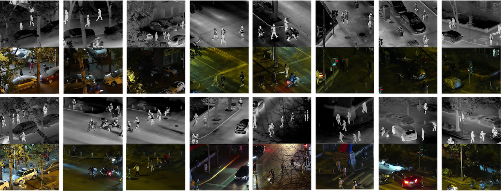

# LLVIP: A Visible-infrared Paired Dataset for Low-light Vision
[Project](https://bupt-ai-cz.github.io/LLVIP/) | [Arxiv](https://arxiv.org/abs/2108.10831) | [Benchmarks](https://paperswithcode.com/dataset/llvip)|[](https://paperswithcode.com/sota/pedestrian-detection-on-llvip?p=llvip-a-visible-infrared-paired-dataset-for) | [](https://twitter.com/intent/tweet?text=Codes%20and%20Data%20for%20Our%20Paper:%20"LLVIP:%20A%20Visible-infrared%20Paired%20Dataset%20for%20Low-light%20Vision"%20&url=https://github.com/bupt-ai-cz/LLVIP)  

## News
- ⚡(2021-11-24): Pedestrian detection models were released. 
- ⚡(2021-09-01): We have released the dataset, please visit [homepage](https://bupt-ai-cz.github.io/LLVIP/) for access to the dataset. (Note that we removed some low-quality images from the original dataset, and for this version there are 30976 images.)

---



---

## Citation
If you use this data for your research, please cite our paper [LLVIP: A Visible-infrared Paired Dataset for Low-light Vision](https://arxiv.org/abs/2108.10831):

```
@inproceedings{jia2021llvip,
  title={LLVIP: A Visible-infrared Paired Dataset for Low-light Vision},
  author={Jia, Xinyu and Zhu, Chuang and Li, Minzhen and Tang, Wenqi and Zhou, Wenli},
  booktitle={Proceedings of the IEEE/CVF International Conference on Computer Vision},
  pages={3496--3504},
  year={2021}
}
```

<h2> <p align="center"> Image Fusion </p> </h2>  

Baselines
   - [GTF](https://github.com/jiayi-ma/GTF)
   - [FusionGAN](https://github.com/jiayi-ma/FusionGAN)
   - [Densefuse](https://github.com/hli1221/imagefusion_densefuse)
   - [IFCNN](https://github.com/uzeful/IFCNN)

## FusionGAN
### Preparation
- Install requirements
  ```bash
  git clone https://github.com/bupt-ai-cz/LLVIP.git
  cd LLVIP/FusionGAN
  # Create your virtual environment using anaconda
  conda create -n FusionGAN python=3.7
  conda activate FusionGAN
  
  conda install matplotlib scipy==1.2.1 tensorflow-gpu==1.14.0 
  pip install opencv-python
  sudo apt install libgl1-mesa-glx
  ```
- File structure
  ```
  FusionGAN
  ├── ...
  ├── Test_LLVIP_ir
  |   ├── 190001.jpg
  |   ├── 190002.jpg
  |   └── ...
  ├── Test_LLVIP_vi
  |   ├── 190001.jpg
  |   ├── 190002.jpg
  |   └── ...
  ├── Train_LLVIP_ir
  |   ├── 010001.jpg
  |   ├── 010002.jpg
  |   └── ...
  └── Train_LLVIP_vi
      ├── 010001.jpg
      ├── 010002.jpg
      └── ...
  ```
### Train
  ```bash
  python main.py --epoch 10 --batch_size 32
  ```
See more training options in `main.py`.
### Test
  ```bash
  python test_one_image.py
  ```
Remember to put pretrained model in your `checkpoint` folder and change corresponding model name in `test_one_image.py`.
To acquire complete LLVIP dataset, please visit https://bupt-ai-cz.github.io/LLVIP/.

## Densefuse
### Preparation
- Install requirements
  ```bash
  git clone https://github.com/bupt-ai-cz/LLVIP.git
  cd LLVIP/imagefusion_densefuse
  
  # Create your virtual environment using anaconda
  conda create -n Densefuse python=3.7
  conda activate Densefuse
  
  conda install scikit-image scipy==1.2.1 tensorflow-gpu==1.14.0
  ```
- File structure
  ```
  imagefusion_densefuse
  ├── ...
  ├──datasets
  |  ├──010001_ir.jpg
  |  ├──010001_vi.jpg
  |  └── ...
  ├──test
  |  ├──190001_ir.jpg
  |  ├──190001_vi.jpg
  |  └── ...
  └──LLVIP
     ├── infrared
     |   ├──train
     |   |  ├── 010001.jpg
     |   |  ├── 010002.jpg
     |   |  └── ...
     |   └──test
     |      ├── 190001.jpg
     |      ├── 190002.jpg
     |      └── ...
     └── visible
         ├──train
         |   ├── 010001.jpg
         |   ├── 010002.jpg
         |   └── ...
         └── test
             ├── 190001.jpg
             ├── 190002.jpg
             └── ...
  ```
  
### Train & Test
  ```bash
  python main.py 
  ```
Check and modify training/testing options in `main.py`. Before training/testing, you need to rename the images in LLVIP dataset and put them in the designated folder. We have provided a script named `rename.py` to rename the images and save them in the `datasets` or `test` folder. Checkpoints are saved in `./models/densefuse_gray/`. To acquire complete LLVIP dataset, please visit https://bupt-ai-cz.github.io/LLVIP/.

## IFCNN
Please visit https://github.com/uzeful/IFCNN.

<h2> <p align="center"> Pedestrian Detection </p> </h2> 

Baselines
   - [Yolov5](https://github.com/ultralytics/yolov5)
   - [Yolov3](https://github.com/ultralytics/yolov3)
## Yolov5
### Preparation
#### Linux and Python>=3.6.0
- Install requirements
  ```bash
  git clone https://github.com/bupt-ai-cz/LLVIP.git
  cd LLVIP/yolov5
  pip install -r requirements.txt
  ```
- File structure
  ```
  yolov5
  ├── ...
  └──LLVIP
     ├── labels
     |   ├──train
     |   |  ├── 010001.txt
     |   |  ├── 010002.txt
     |   |  └── ...
     |   └──val
     |      ├── 190001.txt
     |      ├── 190002.txt
     |      └── ...
     └── images
         ├──train
         |   ├── 010001.jpg
         |   ├── 010002.jpg
         |   └── ...
         └── val
             ├── 190001.jpg
             ├── 190002.jpg
             └── ...
  ```
  We provide a script named `xml2txt_yolov5.py` to convert xml files to txt files, remember to modify the file path before using.
### Train
  ```bash
  python train.py --img 1280 --batch 8 --epochs 200 --data LLVIP.yaml --weights yolov5l.pt --name LLVIP_export
  ```
See more training options in `train.py`. The pretrained model `yolov5l.pt` can be downloaded from [here](https://github.com/ultralytics/yolov5/releases). The trained model will be saved in `./runs/train/LLVIP_export/weights` folder.
### Test
  ```bash
  python val.py --data --img 1280 --weights last.pt --data LLVIP.yaml
  ```
  Remember to put the trained model in the same folder as `val.py`.
  
  Our trained model can be downloaded from here: [Google-Drive-Yolov5-model](https://drive.google.com/file/d/1SPbr0PDiItape602-g-bstkX0P7NZo0q/view?usp=sharing) or [BaiduYun-Yolov5-model](https://pan.baidu.com/s/1q3mGhQzT_D3uiqdfAHVqCA) (code: qepr)
- Click [Here](yolov3/README.md) for the tutorial of Yolov3 （Our trained Yolov3 model can be downloaded from here: [Google-Drive-Yolov3-model](https://drive.google.com/file/d/1-BYauAZGXhw7PjKp8M4CHlnMNYqm8n7J/view?usp=sharing) or [BaiduYun-Yolov3-model](https://pan.baidu.com/s/1eZcyugmpo_3VZjd3wpwcow) (code: ine5)）.
### Results
We retrained and tested Yolov5l and Yolov3 on the updated dataset (30976 images).
<div align="center">

</div>

Where AP means the average of AP at IoU threshold of 0.5 to 0.95, with an interval of 0.05.
<div align="center">

</div>
The figure above shows the change of AP under different IoU thresholds. When the IoU threshold is higher than 0.7, the AP value drops rapidly. Besides, the infrared image highlights pedestrains and achieves a better effect than the visible image in the detection task, which not only proves the necessity of infrared images but also indicates that the performance of visible-image pedestrian detection algorithm is not good enough under low-light conditions.

We also calculated log average miss rate based on the test results and drew the miss rate-FPPI curve.
<div align="center">

</div>

<div align="center">

</div>

<h2> <p align="center"> Image-to-Image Translation </p> </h2> 

Baseline
   - [pix2pixGAN](https://github.com/phillipi/pix2pix)
## pix2pixGAN
### Preparation
- Install requirements
  ```bash
  cd pix2pixGAN
  pip install -r requirements.txt
  ```
- [Prepare dataset](https://github.com/junyanz/pytorch-CycleGAN-and-pix2pix/blob/master/docs/datasets.md)
- File structure
  ```
  pix2pixGAN
  ├── ...
  └──datasets
     ├── ...
     └──LLVIP
        ├── train
        |   ├── 010001.jpg
        |   ├── 010002.jpg
        |   ├── 010003.jpg
        |   └── ...
        └── test
            ├── 190001.jpg
            ├── 190002.jpg
            ├── 190003.jpg
            └── ...
  ```

### Train
  ```bash
  python train.py --dataroot ./datasets/LLVIP --name LLVIP --model pix2pix --direction AtoB --batch_size 8 --preprocess scale_width_and_crop --load_size 320 --crop_size 256 --gpu_ids 0 --n_epochs 100 --n_epochs_decay 100
  ```
### Test
  ```bash
  python test.py --dataroot ./datasets/LLVIP --name LLVIP --model pix2pix --direction AtoB --gpu_ids 0 --preprocess scale_width_and_crop --load_size 320 --crop_size 256
  ```
  See `./pix2pixGAN/options` for more train and test options.
### Results
We retrained and tested pix2pixGAN  on the updated dataset(30976 images). The structure of generator is unet256, and the structure of discriminator is the basic PatchGAN as default. 
<div align="center">

</div>

<div align="center">

</div>

## License
This LLVIP Dataset is made freely available to academic and non-academic entities for non-commercial purposes such as academic research, teaching, scientific publications, or personal experimentation. Permission is granted to use the data given that you agree to our [license terms](Term%20of%20Use%20and%20License.md).

## Call For Contributions

Welcome to point out errors in data annotation. Also welcome to contribute more data annotations, such as segmentation. Please contact us.

## Contact

email: shengjie.Liu@bupt.edu.cn, czhu@bupt.edu.cn, jiaxinyujxy@qq.com, tangwenqi@bupt.edu.cn
